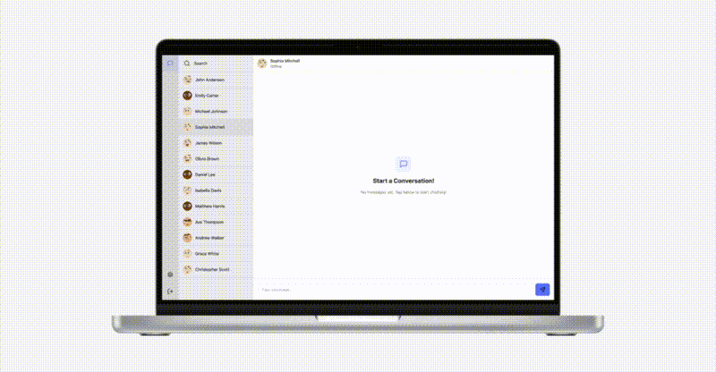

# Relay: Send. Receive. Connect.

Full-stack messaging application built using the PERN stack (PostgreSQL, Express, React, and Node).



## Table of Contents

- [Relay: Send. Receive. Connect.](#relay-send-receive-connect)
  - [Table of Contents](#table-of-contents)
  - [Getting Started](#getting-started)
    - [Prerequisites](#prerequisites)
    - [Installation](#installation)
  - [Development and Testing](#development-and-testing)
  - [Development Plan and Improvements](#development-plan-and-improvements)
  - [Project Structure](#project-structure)
  - [Contributing](#contributing)
  - [License](#license)
  - [Support](#support)

## Getting Started

### Prerequisites
Before getting started, ensure you have the following installed:
- [Node.js](https://nodejs.org/)
- [npm](https://www.npmjs.com/)

### Installation

Follow these steps to set up the application locally:

1. **Clone the repository:**

```bash
git clone https://github.com/imseanconroy/relay.git
cd relay
```

2. **Frontend Setup:**

    1. Navigate to the frontend directory and install dependencies:
    ```bash
    cd frontend
    npm install
    ```

    2. Configure environment variables by creating a `.env` file in the `frontend` directory:
    ```env
    NODE_ENV=development
    ```

    3. Start the frontend development server:
    ```bash
    npm run dev
    ```

3. **Backend Setup:**

    1. Navigate to the backend directory and install dependencies:
    ```bash
    cd backend
    npm install
    ```

    2. Configure environment variables by creating a `.env` file in the `backend` directory:
    ```env
    DATABASE_URL=<your_database_url>
    JWT_SECRET=<your_jwt_secret>
    NODE_ENV=development
    PORT=3000
    ```

    3. Run PG-migrate to set databse tables:
   ```
   npm run migrate:up
   ```

    4. Start the backend development server:
    ```bash
    npm run dev
    ```

## Development and Testing

Run all tests with the following command:
```bash
npm run test
```

## Development Plan and Improvements

This section outlines upcoming features and improvements:

1. **User Features:**
   - **Integrate email validation and forgotten password functionality.**
   - Add functionality to update and delete messages.
   - Enable replying to messages and creating message threads.
   - Improve search functionality with optimized API calls and enhanced UI.
   - Implement avatars customization and image uploads.

2. **UI/UX Enhancements:**
   - Redesign the chat interface for better usability, particularly on mobile devices.
   - Integrate animations and transitions to enhance user interaction.

3. **Testing and Quality Assurance:**
   - **Expand test coverage for both frontend and backend components.**
   - Automate integration tests using CI/CD pipelines for streamlined deployment.
   - Introduce comprehensive logging for error tracking and debugging.

4. **Documentation:**
   - Create a detailed API reference.

Feel free to suggest additional improvements by [opening an issue](https://github.com/ImSeanConroy/relay/issues/new/choose).

## Project Structure

```
relay/
├── frontend/    # React application
├── backend/     # Express.js server and PostgreSQL integration
└── README.md    # Project documentation
```

## Contributing

Contributions are welcome. Please open an issue or submit a pull request for any enhancements or bug fixes.

## License

This project is Distributed under the MIT License - see the [LICENSE](LICENSE) file for information.

## Support

If you are having problems, please let me know by [raising a new issue](https://github.com/ImSeanConroy/relay/issues/new/choose).
